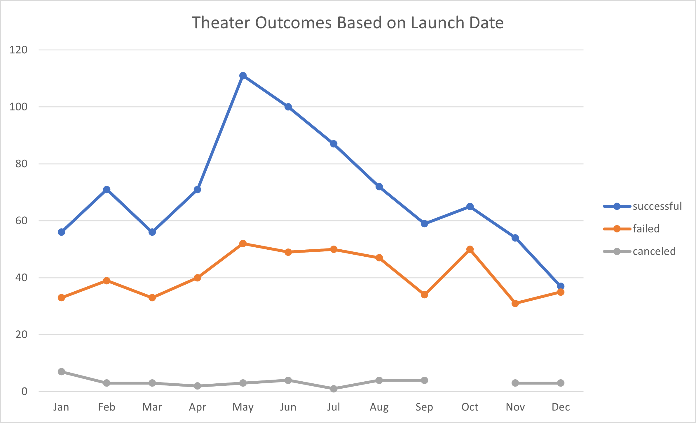
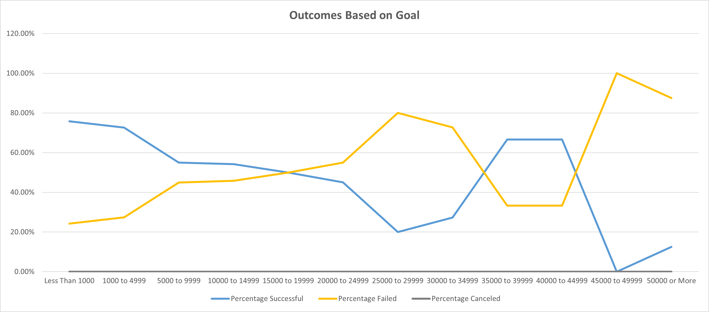

# Kickstarting with Excel

## Overview of Project

### Purpose
Louise’s play *Fever* came close to its fundraising goal in a short amount of time. Now, she wants to know how different campaigns fared in relation to their launch dates and their funding goals. To assist Louise in making decisions involving future kickstarter campaigns the following analysis was done analyze the sampling of kickstarter data, specific to plays, to provide visuals of how different campaigns fared with their outcomes focusing on their goals and launch dates.

## Analysis and Challenges

### Analysis of Outcomes Based on Launch Date
The following graph provides a monthly comparison based on the launch dates of all "successful", "failed", and "canceled" theater campaigns over the entirity of the sampled kickstarter data.

### Analysis of Outcomes Based on Goals
The following chart shows a comparison of what percentage of kickstarter campaigns for plays that succeeded, failed, or were canceled, based on the kickstarters goal amount.

### Challenges and Difficulties Encountered
While building and analyzing the Outcomes vs Goals, my graph was not appearing as expected.  Upon initial review of my "Countifs(...)" functions they appeared correct, so I searched Google to review how the criteria commands should be written.  My initial assumption was that "Live" campaigns were supposed to be included with the "successful" totals. After consulting a few different web pages regarding Excel "Countifs" functions and testing including the "live" records this was found to not be the issue.

I returned to my own functions and worked through each set of criteria.  The resulting issue was finally determined to be due to how the criteria needs to be written regarding a number within a range such as "1000 to 4999". Verfiying the required ranges and functions logic resulted in the expected output being reached.

## Results

### Conclusions for Outcomes Based on Launch Date
Two conclusions that can be drawn from the "Outcomes based on Launch Date" chart have to do with which month(s) could lead to the difference between a successful campaign or a failure. A kickstarter, for a theater campign, that is launched in the spring (between May and June) is the most likely to be successful. While theater campiagns, that are launched at the end of the year, in December, are more prone to failure

### Conclusions for Outcomes Based on Goals
The main conclusion gathered from the "Outcomes based on Goals" is that the higher the kickstarter goal the more likely the kickstarter is to fail.
with Kickstarters with goals set less than 5000 have the highest percentage of success.

### Limitations within the Kickstarter Dataset
- The data provided is a limited data sampling.
- The "Outcomes Based on Launch Date" focus on all Theater campaigns not just plays

### Recommednation for Additional tables and graphs for More Analysis
Providing a table of Measures of Central Tendency along with its corresponding box and whisker plot by month for both success and failure, could assist Louise to see where her goal should be depending on when she plans on starting her next campaign.
